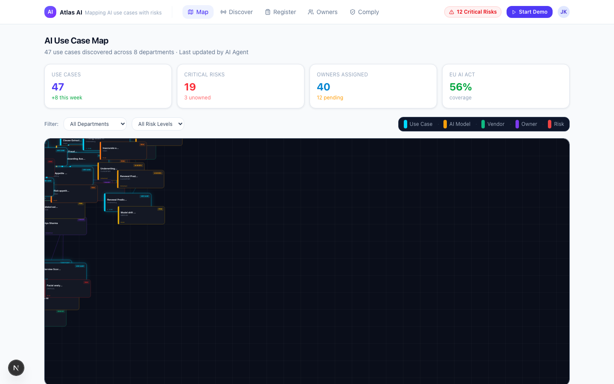
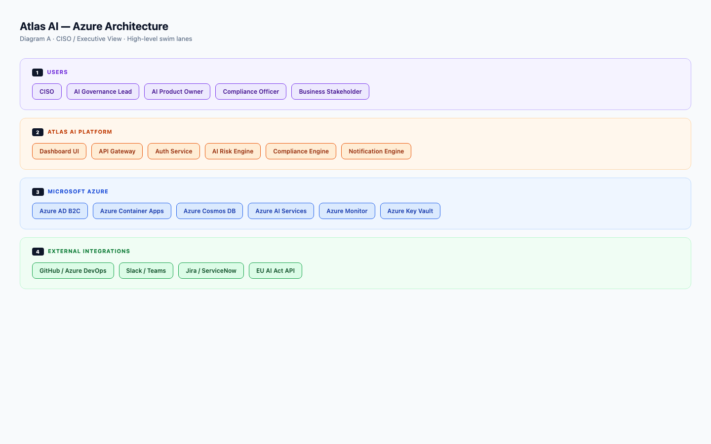
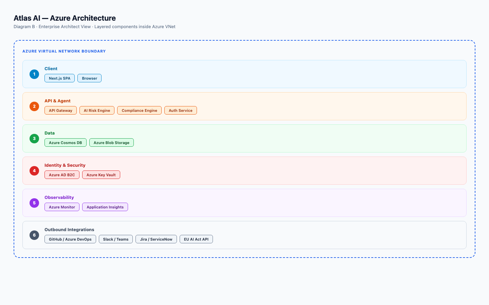

# Atlas AI — Product Marketing Brief

**The AI Governance Platform for Enterprises That Can't Afford to Guess**

---

## The One-Line Pitch

> **Atlas AI gives CISOs and AI governance leaders a single place to see every AI use case across their organisation — mapped to its risks, owners, models, and compliance status — before their regulator asks.**

---

## The Problem We Solve

### AI is spreading faster than governance can follow

Every department is deploying AI. Sales uses it to draft outreach. Finance uses it to forecast. HR uses it to screen CVs. Most of it was never reviewed by security. None of it is tracked in a single place. And your organisation is now subject to the EU AI Act, NIST AI RMF, and a growing stack of AI-specific regulations that assume you know exactly what AI you're running and who owns it.

The reality for most enterprises today:

- **No single inventory** of AI use cases — tools are discovered ad hoc, by accident, or not at all
- **No risk linkage** — even catalogued tools have no assessed risk, no severity, no mitigation status
- **No ownership** — when an AI system causes harm, no one knows who is accountable
- **No compliance readiness** — EU AI Act Article deadlines are live; most organisations cannot produce evidence of controls on demand
- **No early warning** — security teams learn about rogue AI deployments from incidents, not dashboards

This isn't a future risk. It is today's exposure.

---

## What Atlas AI Does

Atlas AI is an **AI Security Posture Management (AI-SPM)** and **AI Asset Management** platform that maps your organisation's AI use cases to their risks, owners, models, and compliance obligations — in a single, interactive dashboard.

It answers six questions every AI governance programme must be able to answer:

| Question | Atlas AI Feature |
|----------|----------------|
| What AI are we running? | Map — interactive AI use case graph |
| How did we find it all? | Discover — three discovery modes |
| Who owns each use case? | Owners — accountability tracking |
| What are the risks? | AI Governance — risk scoring and incident tracking |
| Are we compliant? | Comply — framework coverage across 4 major standards |
| How healthy are our models? | Model Risk — model assessment and context analysis |

---

## Who It's For

### The CISO
You are responsible for AI risk but you don't control AI adoption. You need visibility you don't currently have — a live map of what's running, what the exposure is, and whether mitigations are in place. Atlas AI is built for you.

### The AI Governance Lead
You're building the programme. You need a tool that operationalises your policy — from intake workflows to compliance coverage tracking to owner assignment. Atlas AI is your command centre.

### The Compliance Officer
You need to produce evidence for EU AI Act, NIST AI RMF, ISO 42001, and OWASP LLM Top 10. Atlas AI maps every use case to its framework obligations and shows coverage gaps before auditors find them.

### The AI Product Owner
You build and run AI systems. You need a lightweight way to register your use case, declare your risks, and demonstrate you've applied mitigations. Atlas AI gives you a structured intake flow and a compliance scorecard.

### The Enterprise Architect
You already use tools like Ardoq to map your IT landscape. Atlas AI is the layer that goes deeper — into what AI is running *inside* those systems and whether it's governed. [See how Atlas AI complements Ardoq →](#where-atlas-ai-fits-in-your-enterprise-stack)

---

## Core Capabilities

### 1. Map — See Your Entire AI Landscape at Once

The Atlas AI Map is a live, interactive force-directed graph that visualises every AI use case in your organisation alongside its connected models, vendors, owners, and risks.

**What you can do:**
- Filter by department, risk severity, or compliance status
- Click any node to open a full detail panel — description, data classification, discovery method, risk cards with OWASP / EU AI Act / NIST tags, mitigation status, owner, and compliance scorecard
- Identify unowned use cases instantly (flagged in red)
- See risk clusters by department before they become incidents

**Why it matters:** Most organisations have AI sprawl they can't see. The Map makes the invisible visible — not as a spreadsheet, but as a living graph that updates as your AI estate grows.



---

### 2. Discover — Find AI Before It Finds You

Shadow AI is the new shadow IT. Atlas AI provides three discovery modes to systematically surface AI use cases across your organisation:

**CISO Discovery Campaign**
AI agents conduct structured interviews with department leads — asynchronously, at scale. No manual surveys. No chasing stakeholders. The agent asks the right questions and populates the register automatically.

**Employee Self-Registration**
Share a link. Employees self-report AI tools they use via a conversational intake flow. Low friction. High coverage. Every submission lands in the register for review.

**Auto-Detect via Okta**
Connect to your Okta SaaS estate. Atlas AI monitors application access patterns and surfaces AI-adjacent tools — flagging new entrants and alerting when unreviewed AI activity is detected.

**Why it matters:** You cannot govern what you haven't found. Discovery is not a one-time exercise — it's a continuous programme. Atlas AI automates it.

---

### 3. Register — Structure What You Know

Every discovered AI use case flows into the Atlas AI Register — a structured intake and lifecycle pipeline.

**The five-stage pipeline:**

```
Discovered → Assessed → Owned → Mitigated → Compliant
```

Each stage is tracked with counts, status indicators, and filterable views. You see exactly where every use case is in the governance lifecycle — and what's blocking it from moving forward.

**Registration captures:**
- Use case name, description, and department
- Data classification (public / internal / confidential / restricted)
- Discovery method
- AI models used and vendors
- Assigned owner
- Risk assessments
- Mitigation status
- Compliance framework mappings

**Why it matters:** A governance programme without a register is a policy document with no enforcement. The Register is the source of truth that every other Atlas AI capability is built on.

---

### 4. Owners — Close the Accountability Gap

Unowned AI is ungoverned AI. Atlas AI tracks ownership at the use case level — who is accountable, what they own, and whether they've completed their assessment.

**Owner management includes:**
- Full roster of AI asset owners with contact details
- Use case assignment per owner
- Assessment completion status
- Overdue flags and notification triggers

**Why it matters:** When an AI system causes harm — a biased hiring decision, a hallucinated legal clause, a leaked customer record — "we didn't know who owned it" is not a defensible answer. Atlas AI ensures accountability is explicit and auditable.

---

### 5. Comply — Turn Frameworks into Evidence

Atlas AI maps every registered use case to four major AI governance and security frameworks and shows your coverage — not as a checkbox exercise, but as a live coverage dashboard.

**Frameworks covered:**

| Framework | What It Covers |
|-----------|---------------|
| **EU AI Act** | Regulatory compliance for AI systems operating in or targeting the EU market. Risk classification, prohibited use checks, conformity requirements. |
| **NIST AI RMF** | Risk management lifecycle: Govern, Map, Measure, Manage. Organisational and technical controls. |
| **OWASP LLM Top 10** | Security risks specific to large language models — prompt injection, data leakage, model theft, hallucination, and more. |
| **ISO 42001** | International standard for AI management systems. Governance, accountability, transparency, and continual improvement. |

**The Comply dashboard shows:**
- Overall coverage breakdown per framework (covered / partial / gap) as stacked progress bars
- Priority remediations — the highest-urgency gaps ranked by criticality with deadline dates
- Use case-level compliance scorecards accessible from the Map detail panel

**Why it matters:** The EU AI Act is not theoretical. Enforcement has begun. Atlas AI gives compliance officers a real-time view of where gaps exist and what to fix first — not after an audit, but before one.

---

### 6. AI Governance — Your AI-SPM Command Centre

The AI Governance dashboard is the security operations layer of Atlas AI — purpose-built for CISOs and security teams managing AI risk at scale.

**Includes:**
- Aggregate risk scores across your AI estate
- Compliance posture status per framework
- Incident tracking — known AI-related incidents with severity, status, and remediation notes
- Risk distribution by severity (critical / high / medium / low)
- AI use case health indicators

**Why it matters:** Generic SIEM and GRC tools were not built for AI risk. They don't understand prompt injection. They don't know what a high-risk AI use case under the EU AI Act looks like. Atlas AI speaks the language of AI governance natively.

---

### 7. AI Visibility — Operational Intelligence for AI Assets

The AI Visibility module provides the asset management perspective — treating AI systems as enterprise assets that have operational health metrics, not just risk profiles.

**Covers:**
- Asset inventory with lifecycle status
- Model usage and dependency tracking
- Performance and operational health indicators
- Vendor and provider mapping

**Why it matters:** Governance is not just about risk. It's about knowing that the AI systems you've approved are still performing as expected, still using the models you assessed, and haven't drifted from their original scope.

---

### 8. Model Risk — Assess the Engine, Not Just the Output

AI risk doesn't start with the use case. It starts with the model. Atlas AI's Model Risk module provides model-level assessment and context analysis.

**Covers:**
- Model risk scores and risk context narratives
- Sensitivity of training data
- Known vulnerabilities and exposure vectors
- Model provenance and provider information

**Why it matters:** Two AI use cases built on different models can have radically different risk profiles — even if they serve the same business function. Model Risk makes that visible.

---

## The Full Governance Workflow

```
Discover → Register → Assess Risk → Assign Owner → Map to Frameworks → Monitor Posture
```

Atlas AI supports every step. Use cases move through the pipeline with clear status, clear owners, and clear compliance obligations — from first discovery to audit-ready evidence.

---

## Compliance Coverage in Detail

### EU AI Act
- Prohibited AI practice screening
- Risk classification (Unacceptable / High / Limited / Minimal)
- Conformity assessment readiness
- Technical documentation requirements tracking
- Human oversight control evidence

### NIST AI RMF
- Govern: Policies, accountability structures, culture
- Map: Context, categorisation, risk identification
- Measure: Analysis, prioritisation, residual risk
- Manage: Treatments, response, recovery planning

### OWASP LLM Top 10
- LLM01: Prompt Injection
- LLM02: Insecure Output Handling
- LLM03: Training Data Poisoning
- LLM04: Model Denial of Service
- LLM05: Supply Chain Vulnerabilities
- LLM06: Sensitive Information Disclosure
- LLM07: Insecure Plugin Design
- LLM08: Excessive Agency
- LLM09: Overreliance
- LLM10: Model Theft

### ISO 42001
- AI management system establishment
- Organisational context and leadership
- Risk and opportunity management
- AI system impact assessment
- Continual improvement processes

---

## Where Atlas AI Fits in Your Enterprise Stack

> *"Ardoq tells you what systems you have. Atlas AI tells you what AI those systems are doing — and whether it's safe."*

Many enterprises already use **Ardoq** for enterprise architecture management. Ardoq maps systems, applications, capabilities, and infrastructure dependencies at the IT landscape level. It is the container.

Atlas AI is the content — the layer that maps what AI is running *inside* those systems, who owns it, what risk it carries, and whether it meets your compliance obligations.

| Dimension | Ardoq | Atlas AI |
|-----------|-------|----------|
| Primary object | System / Application / Capability | AI Use Case |
| Risk focus | Architectural dependency risk | AI-specific operational risk |
| Compliance | IT governance frameworks | AI regulation (EU AI Act, OWASP LLM, NIST AI RMF) |
| Visualisation | System maps, roadmaps, tech debt | AI use case force graph + risk graph |
| Audience | Enterprise architects, IT | CISOs, AI governance leads, compliance officers |

They are not competitive. They are complementary. Ardoq maps the enterprise. Atlas AI governs the AI inside it.



---

## Architecture — Built for Enterprise Scale

Atlas AI is designed as a cloud-native platform on Microsoft Azure.

### CISO / Executive View

| Layer | Components |
|-------|-----------|
| Users | CISO, AI Governance Lead, AI Product Owner, Compliance Officer, Business Stakeholder |
| Atlas AI Platform | Dashboard UI, API Gateway, Auth Service, AI Risk Engine, Compliance Engine, Notification Engine |
| Microsoft Azure | Azure AD B2C, Azure Container Apps, Azure Cosmos DB, Azure AI Services, Azure Monitor, Azure Key Vault |
| External Integrations | GitHub / Azure DevOps, Slack / Teams, Jira / ServiceNow, EU AI Act API |

### Enterprise Architect View — Layered Inside Azure VNet

| Layer | Components |
|-------|-----------|
| Client | Next.js SPA, Browser |
| API & Agent | API Gateway, AI Risk Engine, Compliance Engine, Auth Service |
| Data | Azure Cosmos DB, Azure Blob Storage |
| Identity & Security | Azure AD B2C, Azure Key Vault |
| Observability | Azure Monitor, Application Insights |
| Outbound Integrations | GitHub / Azure DevOps, Slack / Teams, Jira / ServiceNow, EU AI Act API |



**Security and compliance by design:**
- Identity managed by Azure AD B2C — enterprise SSO, MFA, role-based access
- All secrets in Azure Key Vault — zero hardcoded credentials
- Full observability via Azure Monitor and Application Insights
- Data at rest in Azure Cosmos DB — geo-redundant, encrypted
- VNet boundary isolates all compute and data services

---

## Integrations

Atlas AI connects with the tools your teams already use:

| Category | Integrations |
|----------|-------------|
| Development | GitHub, Azure DevOps |
| Communication | Slack, Microsoft Teams |
| Ticketing & ITSM | Jira, ServiceNow |
| Identity | Okta (for auto-discovery), Azure AD B2C |
| Regulatory | EU AI Act API |
| SIEM *(roadmap)* | Microsoft Sentinel, Splunk, Chronicle |

---

## Technology Foundation

Built on modern, enterprise-grade open standards:

| Component | Technology |
|-----------|-----------|
| Framework | Next.js 16 (App Router, Turbopack) |
| UI | React 19, TypeScript |
| Styling | Tailwind CSS 4 |
| Components | Radix UI, shadcn/ui |
| Charts & Analytics | Recharts |
| Graph Visualisation | react-force-graph-2d (D3-powered) |
| Cloud | Microsoft Azure |
| Deployment | Vercel / Azure Container Apps |

---

## What's Coming

Atlas AI is a platform in active development. The roadmap reflects the needs of enterprise AI governance programmes as they mature:

| Capability | Why It Matters |
|-----------|---------------|
| **Role-based access control (RBAC)** | Different views for different personas — CISO sees risk posture; compliance officer sees framework gaps; owner sees their use cases only |
| **Exportable audit reports** | One-click PDF/CSV evidence packages for regulatory submissions and internal audits |
| **SIEM integration** — Sentinel, Splunk, Chronicle | Feed AI risk signals into existing security operations workflows |
| **Real telemetry ingestion** | Move from simulated to live data — connect directly to model inference endpoints, API gateways, and LLM observability tools |
| **Model cluster visualisation** | Map the relationships between model families, fine-tunes, and deployed variants across your estate |
| **Agent behaviour analytics** | Track what AI agents are doing — tool calls, data access, output patterns — and flag anomalies |

---

## Summary — Why Atlas AI

| Challenge | How Atlas AI Addresses It |
|-----------|--------------------------|
| AI sprawl — no one knows what's running | Map + Discover: continuous, multi-mode discovery and visual inventory |
| No risk visibility | AI Governance: risk scoring, severity classification, incident tracking |
| Compliance gaps with EU AI Act, NIST, OWASP | Comply: real-time framework coverage with gap prioritisation |
| Unowned AI systems | Owners: explicit accountability with assessment status |
| Model risk not separated from use case risk | Model Risk: model-level assessment independent of use case |
| No integration with existing enterprise stack | Native integrations with Okta, GitHub, Slack, Jira, ServiceNow, Azure |
| Doesn't replace Ardoq | Complementary layer — Ardoq is the container, Atlas AI is the AI governance content inside it |

---

## Licence

Atlas AI is released under the **MIT Licence**. Use it, extend it, deploy it. Build the governance programme your organisation needs.

---

*For demos, partnership enquiries, or enterprise deployment discussions — [contact the Atlas AI team].*
